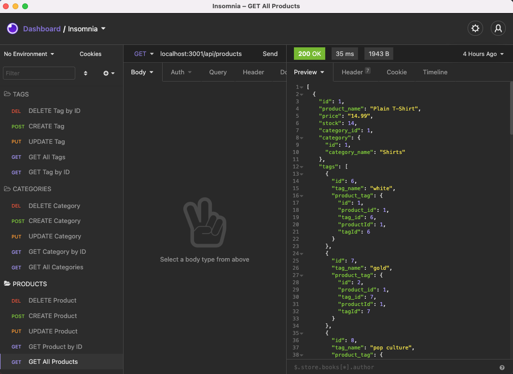

# E-Commerce Back End
  

  ## Description
  As a manager at an internet retail company I want a back end for my e-commerce website that uses the latest technologies. This application uses NodeJS, MySQL, Express.

  ## Table of Contents
  * [Installation](#installation)
  * [Usage](#usage)
  * [License](#license)
  * [Contributing](#contributing)
  * [Tests](#tests)
  * [Questions](#questions)
  
  ## Installation
  Use the `schema.sql` file in the `db` folder to create your database with MySQL shell commands.If you do not have Node.js or npm installed, you will first need to install them.
  [Install Node.js and npm](https://docs.npmjs.com/downloading-and-installing-node-js-and-npm)

  ## Usage
  After creating your database, seed it with the data in the application by running 'npm run seed'. Then start the application with the command 'npm start'.

  :movie_camera: [Walkthrough video](https://drive.google.com/file/d/1-eUhK_c6mTtRHzDhjjtVnR7PJHFw-bu3/view)

  :camera: 

  ## License
  Licensed under [MIT License](https://spdx.org/licenses/MIT.html).

  ## Contributing
  Anyone can participate in the project to submit bugs and make pull requests for anything from typos to new content. If you are interested in fixing issues and contributing to this project, please refer to the [Contributor Covenant](https://www.contributor-covenant.org/).

  ## Tests
  Currently no tests exists for the application. If you would like to contribute and help us by writing them, see the [Contributing](#contributing) section.

  ## Questions
  For more information about me and my other projects, visit my [GitHub profile](https://github.com/LindseyJeeJan). Reach me to report issues or with questions at [ljjlauria@mac.com](mailto:ljjlauria@mac.com).
